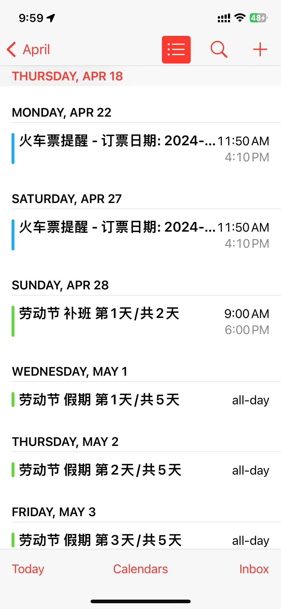
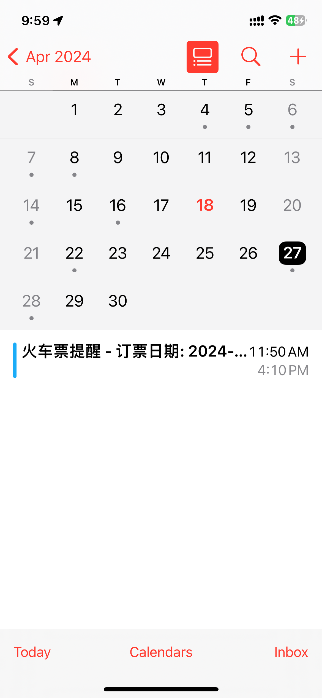

# 节假日调休火车票预定提醒

经常需要操心在预定节假日的火车票，导入这个日历后，会在提醒节假日开始前一天和结束后一天，还有调休当天的火车票。

## 使用

手机访问[网页](https://holiday-calendar-remind-sub.vercel.app/)或者扫下面二维码，点击导入日历，然后会调起日历应用，导入日历即可。

效果如下, 配合[china-holiday-calender](https://github.com/lanceliao/china-holiday-calender)使用更佳

## 说明

- 节假日和调休数据来自[china-holiday-calender](https://github.com/lanceliao/china-holiday-calender)
- 火车票预定间隔默认14天
- action会在每年的的12月20日生成下一年的日历

## 二改

代码在`script/generate_next_year_book_train_ics.py`中，运行即可，有问题提issue